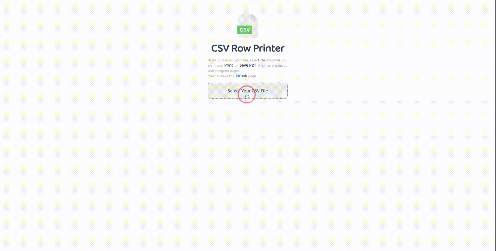

# CSV Row Printer

CSV Row Printer is a tool that helps you upload your CSV files to it and separate the information in each row and print it as a card or output it.

Your CSV file information is never sent to the server. No tracking, analytics, or fingerprinting are used on this website. 

[Demo](https://raminr77.github.io/csv-row-printer/)

## Capabilities:
<ul>
  <li>Search in cards</li>
  <li>Support RTL layout</li>
  <li>Build custom QR Code</li>
  <li>Print selected columns</li>
  <li>Build QR Code from column</li>
  <li>Change the range of the rows</li>
  <li>Add header and footer to the cards</li>
  <li>Merge (Group By) rows with custom column</li>
  <li>Change the name of the columns or labels</li>
  <li>Change the width and height of the cards</li>
</ul>

## Development
1. Make sure you have `yarn` installed.
2. Run `yarn` for install **devDependencies** command.
3. Run `yarn sass` to compile SCSS files.
4. Run **index.html** with the [live Server](https://marketplace.visualstudio.com/items?itemName=ritwickdey.LiveServer)
