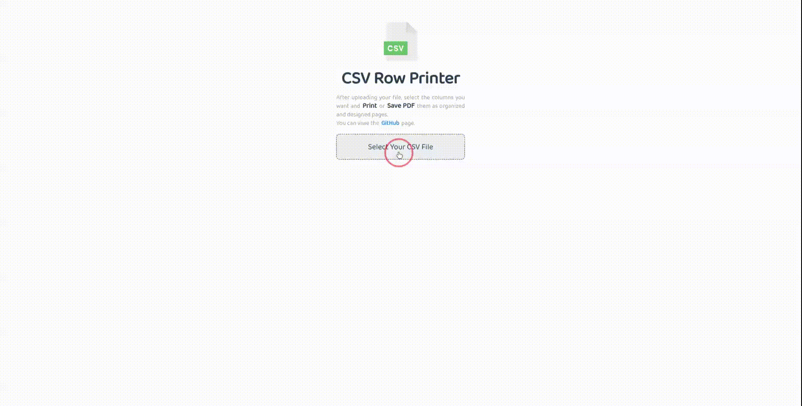

# CSV Row Printer

[](https://github.com/raminr77/csv-row-printer/)



<p>
CSV Row Printer turns each row of a CSV file into a clean, printable card. Upload
a file, pick the columns you care about, customize the layout, then print the
cards or save them as a PDF.
</p>
<p>
All parsing happens in your browser — your CSV data is never uploaded to a
server. The hosted demo loads Google Tag Manager / Google Analytics for anonymous
visit statistics only; it never receives your file contents. Remove the GTM and
GA snippets from <code>index.html</code> if you want a fully analytics-free build.
</p>

[Demo](https://raminr77.github.io/csv-row-printer/)

## Capabilities

<ul>
  <li>Stream and parse large CSV files without freezing the UI</li>
  <li>Choose color themes for the cards</li>
  <li>Search within the generated cards</li>
  <li>RTL layout support</li>
  <li>Build a custom QR Code, or generate one from a column's value</li>
  <li>Print only the columns you select</li>
  <li>Change the row range</li>
  <li>Add a header and footer to the cards</li>
  <li>Merge (group by) rows using a column</li>
  <li>Rename column labels</li>
  <li>Change the width and min height of the cards</li>
</ul>

## Development

This project is plain HTML, JavaScript (ES modules), and SCSS — no bundler.

1. Install [pnpm](https://pnpm.io/installation).
2. Run `pnpm install` to install dev dependencies.
3. Run `pnpm dev` to watch and compile the SCSS files (or `pnpm build` for a one-off build).
4. Open `index.html` with the [Live Server](https://marketplace.visualstudio.com/items?itemName=ritwickdey.LiveServer) extension.

## Scripts

| Command              | Description                              |
| -------------------- | ---------------------------------------- |
| `pnpm dev`           | Watch and compile SCSS                    |
| `pnpm build`         | Compile SCSS once (minified)              |
| `pnpm test`          | Run the unit tests (Vitest)               |
| `pnpm test:watch`    | Run the tests in watch mode               |
| `pnpm test:coverage` | Run the tests with a coverage report      |
| `pnpm format`        | Format the source with Prettier           |
| `pnpm format:check`  | Check formatting without writing changes  |

## Testing

Pure, DOM-free logic lives in [`src/core/core.js`](./src/core/core.js) and is
covered by [Vitest](https://vitest.dev) tests in [`tests/`](./tests). Run them with:

```bash
pnpm test
```
